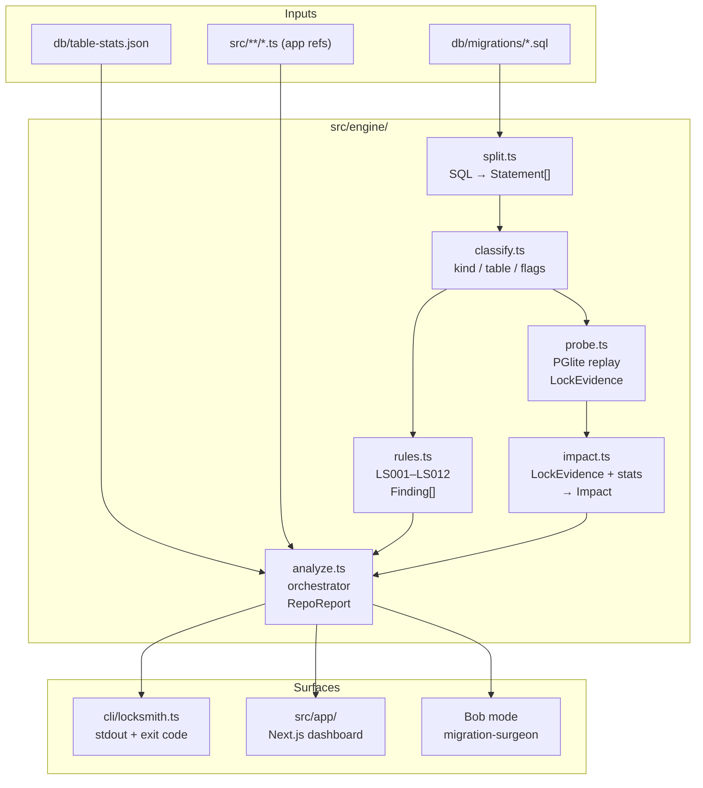

# LockSmith — Architecture

## 1. Module Layout (`src/engine/`)

```
src/
├── engine/
│   ├── types.ts      — All shared TypeScript types (Severity, RuleId, Statement, Migration,
│   │                   TableStats, LockEvidence, Impact, Finding, MigrationReport, RepoReport)
│   ├── split.ts      — Splits a raw SQL string into Statement[] (handles $$ bodies, string
│   │                   literals, line/block comments, semicolons inside quotes)
│   ├── classify.ts   — Tags each Statement with kind, table, columns, flags
│   │                   (concurrently, notValid, hasWhere, volatileDefault, constantDefault)
│   ├── rules.ts      — Pure functions: one per rule ID (LS001–LS012), each taking
│   │                   (stmt: Statement, migration: Migration, stats: TableStats,
│   │                    appRefs: AppReference[]) → Finding | null
│   ├── probe.ts      — Embeds PGlite; replays migrations; for every statement captures
│   │                   pg_locks snapshot, detects relfilenode change (rewrite), catches errors
│   ├── impact.ts     — Converts LockEvidence + TableStats → Impact
│   │                   (durationClass, estSeconds, blockedWrites, blocking flag)
│   └── analyze.ts    — Orchestrator: calls split → classify → rules + probe + impact,
│                       assembles MigrationReport[] → RepoReport (riskScore, gate pass/fail)
│
├── app/              — Next.js App Router pages and components (UI surface)
│
cli/
└── locksmith.ts      — CLI entry point: calls analyze(), prints findings, exits with code 1
                        if RepoReport.gate === "fail"
```

## 2. Data Flow

```
db/migrations/*.sql          db/table-stats.json      src/**/*.ts
       │                            │                       │
       ▼                            ▼                       ▼
  read SQL files              parse JSON              grep for identifiers
       │                            │                       │
       └──────────────┬─────────────┘                       │
                      ▼                                     │
              split.ts                                      │
          Statement[] per file                              │
                      │                                     │
                      ▼                                     │
             classify.ts                                    │
          kind / table / columns / flags                    │
                      │                                     │
          ┌───────────┴────────────┐                        │
          ▼                        ▼                        │
       rules.ts                 probe.ts                    │
    (static analysis)       (PGlite replay)                 │
    Finding[] (no lock     LockEvidence per stmt            │
    evidence yet)               │                          │
          │                     ▼                           │
          │                  impact.ts                      │
          │              Impact (estSeconds,                │
          │               blockedWrites)                    │
          │                     │                           │
          └──────────┬──────────┘              AppReference[]
                     ▼                               │
                 analyze.ts  ◄──────────────────────┘
            merges Findings + Evidence + Impact
            computes riskScore 0–100
            evaluates gate (pass/fail: any critical ⇒ fail)
                     │
                     ▼
              RepoReport
           (MigrationReport[])
          ┌──────────┴──────────┐
          ▼                      ▼
   cli/locksmith.ts         src/app/ (Next.js)
   stdout findings           dashboard, per-migration
   exit 1 on fail            lock timeline, Bob diff
```

## 3. CLI (`cli/locksmith.ts`)

- Parses `--dir` and optional `--json <path>` flags.
- Calls `analyze(dir)` which returns a `RepoReport`.
- Prints each `Finding` grouped by migration (coloured severity prefix).
- Writes JSON if `--json` supplied.
- `process.exit(1)` when `report.gate === "fail"`.
- Used in CI: `npm run locksmith -- --dir demo-repo`.

## 4. Next.js UI (`src/app/`)

- Runs `analyze()` at build time (or in a Route Handler for the live "paste" analyzer).
- `/` — repository dashboard: `RepoReport.riskScore`, gate badge, migration list sorted by risk.
- `/migration/[name]` — per-migration page: lock timeline (one row per statement), finding cards
  with `evidence.locks`, `impact.estSeconds`, `impact.blockedWrites`, and the Bob rewrite diff.
- `/analyze` — paste-a-migration analyzer (client form → `/api/analyze` Route Handler).
- Consumes `MigrationReport` and `Finding` types directly from `src/engine/types.ts`; no
  separate API serialisation layer needed.

## 5. Bob `migration-surgeon` Mode

- Defined in `.bob/custom_modes.yaml`.
- Loaded with `locksmith-report.json` (a `RepoReport`) as context.
- Spawns one subagent per flagged migration; each receives the relevant `MigrationReport`.
- Each subagent rewrites the migration into safe expand/contract files and produces the minimal
  application-code changes (dual-write / read switch).
- Parent task merges results, re-runs `npm run locksmith -- --dir <repo>`, and verifies that
  `riskScore` dropped and no `critical` findings remain.
- Edit permissions restricted to `db/migrations/**` and `src/**`.
- Skill `lock-audit` (`.bob/skills/lock-audit/SKILL.md`) provides the step-by-step checklist:
  read report → read Postgres lock reference → rewrite → run gate → summarise before/after.

## 6. Mermaid Flowchart



## 7. Acceptance Test — Expected Rule Firings per Demo Migration

The following table is the ground truth for integration tests. Each row states the migration,
the rule(s) expected to fire, their expected severity, and the reasoning.

### 002 — `002_orders_customer_index.sql`

| Rule | Severity | Reason |
|------|----------|--------|
| **LS001** | **critical** | `CREATE INDEX` without `CONCURRENTLY` on `orders` (42 M rows > 1 M threshold). Acquires ShareLock for the duration of a full index build. |
| **LS010** | medium | Migration acquires ACCESS SHARE / ShareLock but has no `SET lock_timeout`; any queued long-running query blocks the lock queue behind it. |

### 003 — `003_orders_shipped_at.sql`

| Rule | Severity | Reason |
|------|----------|--------|
| **LS002** | **critical** | `ADD COLUMN shipped_at … NOT NULL DEFAULT now()` — `now()` is not a constant; treated as no usable constant default for pre-existing rows. |
| **LS003** | high | `DEFAULT now()` is volatile (`now()` / `CURRENT_TIMESTAMP`); PostgreSQL must rewrite the entire `orders` table to materialise the per-row default. |
| **LS002** | **critical** | `ADD COLUMN tracking_code text NOT NULL` — NOT NULL with no DEFAULT; statement fails on a non-empty table. |
| **LS010** | medium | Both ADD COLUMN statements take ACCESS EXCLUSIVE; no `SET lock_timeout` present. |

### 004 — `004_rename_customer_email.sql`

| Rule | Severity | Reason |
|------|----------|--------|
| **LS008** | **critical** | `RENAME COLUMN email TO email_address` while `src/customers.ts` references the old name `email` in two queries: `SELECT id, email, full_name …` and `INSERT INTO customers (email, full_name) …`. |
| **LS010** | medium | `RENAME COLUMN` takes ACCESS EXCLUSIVE; no `SET lock_timeout`. |

### 005 — `005_orders_total_precision.sql`

| Rule | Severity | Reason |
|------|----------|--------|
| **LS004** | **critical** | `ALTER COLUMN total TYPE numeric(12,2)` on `orders` (42 M rows > 1 M). Type change forces a full table rewrite under ACCESS EXCLUSIVE; minutes of write blocking. |
| **LS010** | medium | ACCESS EXCLUSIVE acquired; no `SET lock_timeout`. |

### 006 — `006_order_items_fk.sql`

| Rule | Severity | Reason |
|------|----------|--------|
| **LS006** | high | `ADD CONSTRAINT fk_order_items_order FOREIGN KEY … REFERENCES orders(id)` without `NOT VALID`; validates all 118 M `order_items` rows under ShareRowExclusiveLock, blocking writes to both tables for the scan duration. |
| **LS010** | medium | ShareRowExclusiveLock acquired; no `SET lock_timeout`. |

### 007 — `007_backfill_status.sql`

| Rule | Severity | Reason |
|------|----------|--------|
| **LS012** | high | `UPDATE orders SET status = 'pending' WHERE status IS NULL` — no key-range predicate; updates every NULL row of a 42 M-row table in a single transaction, holding RowExclusiveLock for a full scan. |
| **LS005** | high | `ALTER COLUMN status SET NOT NULL` on an existing `orders` column performs a full table scan under ACCESS EXCLUSIVE to verify no NULLs remain. |
| **LS010** | medium | ACCESS EXCLUSIVE acquired by the SET NOT NULL; no `SET lock_timeout`. |

### 008 — `008_products_title_search.sql`

| Rule | Severity | Reason |
|------|----------|--------|
| *(none)* | — | `CREATE INDEX CONCURRENTLY` is the correct pattern. `products` is a small table (56 K rows). The migration contains only one statement so LS011 does not fire. No ACCESS EXCLUSIVE is taken so LS010 does not fire. |

---

*Last updated: Task 1 — architecture + contracts only. Rules are not yet implemented.*
